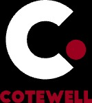

# Cotewell — Header & Footer Design System
> **Reference document for new projects.** Copy the HTML, CSS, and JS blocks below to replicate the Cotewell brand header, footer, animations, scroll behaviour and brand guidelines exactly.

---

## 1. Brand Tokens (CSS Custom Properties)

```css
:root {
  /* Core palette */
  --black:  #000;
  --ink:    #090a0b;       /* page background */
  --soft-ink: #141618;
  --paper:  #f2f1ee;       /* light section background */
  --white:  #fff;

  /* Market segment colours (use for accents/tags) */
  --market-carparks:   #EA7600;
  --market-warehouses: #0092BC;
  --market-workshops:  #702082;
  --market-other:      #009681;

  /* Signal / CTA red */
  --red:          #A6192E;
  --signal:       #A6192E;
  --signal-bright:#A6192E;

  /* Divider lines */
  --line-dark:   rgba(0, 0, 0, 0.16);
  --line-light:  rgba(255, 255, 255, 0.16);

  /* Muted text */
  --muted-dark:  rgba(0, 0, 0, 0.64);
  --muted-light: rgba(255, 255, 255, 0.72);

  /* Layout */
  --shell: 1760px;                              /* max content width */
  --gutter: max(24px, calc(100vw * 0.04));      /* fluid side padding */

  /* Header */
  --site-header-height: 108px;                  /* updated by JS at runtime */
  --section-nav-height: 0px;                    /* 0 if section-nav removed */

  /* Typography */
  --live-body-copy: clamp(1.26rem, calc(1.26rem + .12vw), 1.35rem);
}
```

---

## 2. Fonts

Self-hosted — copy files from `assets/fonts/` to your new project.

```css
@font-face {
  font-family: "Big John";
  src: url("assets/fonts/Big John.otf") format("opentype");
  font-style: normal;
  font-weight: normal;
  font-display: swap;
}

@font-face {
  font-family: "Open Sans";
  src: url("assets/fonts/OpenSans-VariableFont_wdth,wght.ttf") format("truetype");
  font-style: normal;
  font-weight: 300 900;
  font-display: swap;
}

@font-face {
  font-family: "Open Sans";
  src: url("assets/fonts/OpenSans-Italic-VariableFont_wdth,wght.ttf") format("truetype");
  font-style: italic;
  font-weight: 300 900;
  font-display: swap;
}
```

| Role | Family | Weight | Notes |
|---|---|---|---|
| Headings (h1–h3), Buttons | **Big John** | 800 | All-caps, tight tracking |
| Body copy, UI text | **Open Sans** | 300–900 | Variable font |
| Mono labels | Open Sans (monospace stack) | 500 | `letter-spacing: 0.12em; text-transform: uppercase` |

---

## 3. Global Resets & Base Styles

```css
*, *::before, *::after { box-sizing: border-box; }

html {
  scroll-behavior: smooth;
  background: var(--ink);
}

section[id] {
  scroll-margin-top: calc(var(--site-header-height) + var(--section-nav-height) + 18px);
}

body {
  margin: 0;
  min-width: 320px;
  background: var(--ink);
  color: var(--white);
  font-family: "Open Sans", sans-serif;
  font-size: var(--live-body-copy);
  line-height: 1.65;
  -webkit-font-smoothing: antialiased;
  text-rendering: optimizeLegibility;
}

body.menu-open { overflow: hidden; }

img { display: block; max-width: 100%; }

a { color: inherit; text-decoration: none; }

button, input, select, textarea { font: inherit; }

button, a { -webkit-tap-highlight-color: transparent; }

h1, h2, h3, p { text-wrap: pretty; }

h1, h2, h3 { font-family: "Big John", sans-serif; }
```

---

## 4. Layout Shell

```css
/* Centred content container — use on every row */
.shell {
  width: min(calc(100% - (var(--gutter) * 2)), var(--shell));
  margin-inline: auto;
}
```

---

## 5. Typography Utilities

```css
/* Mono label: e.g. eyebrow prefix, footer nav headings */
.mono {
  font-family: "Open Sans", monospace;
  font-size: 12px;
  font-weight: 500;
  letter-spacing: 0.12em;
  text-transform: uppercase;
}

/* Eyebrow: sits above a heading, with a red dash */
.eyebrow {
  display: flex;
  align-items: center;
  gap: 12px;
  margin: 0 0 18px;
  color: rgba(255, 255, 255, 0.76);
  font-family: "Open Sans", monospace;
  font-size: 12px;
  font-weight: 500;
  letter-spacing: 0.14em;
  text-transform: uppercase;
}

.eyebrow span {           /* the 3px red dash */
  width: 32px;
  height: 3px;
  background: var(--signal);
}

.eyebrow--dark { color: var(--muted-dark); }

/* Usage: <p class="eyebrow"><span></span>Section label</p> */
```

---

## 6. Button System

All buttons are **square-cornered** (`border-radius: 0`). Font is **Big John**, all-caps.

```css
.button {
  min-height: 44px;
  display: inline-flex;
  align-items: center;
  justify-content: center;
  gap: 12px;
  border: 0;
  border-radius: 0;               /* ← brand rule: NO rounding */
  padding: 12px 21px;
  font-family: "Big John", sans-serif;
  font-size: 12px;
  font-weight: 800;
  letter-spacing: 0.055em;
  text-transform: uppercase;
  cursor: pointer;
  transition: background 180ms ease, color 180ms ease, transform 180ms ease;
}

.button:hover { transform: translateY(-2px); }

/* Red fill — primary CTA */
.button--red { background: var(--red); color: var(--white); }
.button--red:hover { background: #7d0019; }

/* Ghost / outline */
.button--outline {
  border: 1px solid rgba(255, 255, 255, .42);
  background: transparent;
  color: var(--white);
}
.button--outline:hover {
  border-color: var(--white);
  background: var(--white);
  color: var(--black);
}

/* Large variant */
.button--large {
  min-height: 54px;
  padding: 16px 28px;
  font-size: 13px;
}
```

> **Button shape rule:** `border-radius: 0` — flat, industrial corners throughout.

### Text-link (bordered inline CTA)

```css
.text-link {
  display: inline-flex;
  align-items: center;
  justify-content: center;
  gap: 8px;
  border: 1px solid currentColor;
  border-radius: 0;
  padding: 10px 18px;
  font-size: 12px;
  font-family: "Big John", sans-serif;
  font-weight: 800;
  letter-spacing: 0.055em;
  text-transform: uppercase;
  transition: background 180ms ease, color 180ms ease, transform 180ms ease;
}
.text-link::after { content: "→"; }
.text-link:hover { opacity: .72; }
.text-link--dark  { color: var(--black); }
.text-link--light { color: var(--white); }
```

---

## 7. Header HTML

```html
<header class="site-header" data-header data-site-header>

  <!-- Utility bar (top strip) -->
  <div class="utility">
    <div class="shell utility__inner">
      <div class="utility__links">
        <a href="/our-story/">About Us</a>
        <div class="learning-menu">
          <button type="button" aria-expanded="false">Learning Centre</button>
          <div class="submenu">
            <a href="/learning-centre/#articles">Articles</a>
            <a href="/video-gallery/">Case studies</a>
            <a href="/video-gallery/">Videos</a>
          </div>
        </div>
        <a href="/request-free-sample/">Free Tape Samples</a>
      </div>
      <div class="utility__contact">
        <a href="tel:1300590505">1300 590 505</a>
        <a href="mailto:enquiries@cotewell.com.au">enquiries@cotewell.com.au</a>
      </div>
    </div>
  </div>

  <!-- Main nav row -->
  <div class="shell main-nav">
    <a class="brand" href="/" aria-label="Cotewell home">
      
    </a>
    <nav class="primary" id="primary-menu" aria-label="Primary navigation">
      <a href="/service/floor-coating-and-sealing/">Floor Coating</a>
      <a href="/service/line-markings/">Line Marking</a>
      <a href="/product-category/line-marking-projector/">Projectors</a>
      <a href="/product-category/tape/">Line Marking Tape</a>
      <a href="/cost-calculator/">Pricing</a>
    </nav>
    <div class="nav-actions">
      <a class="cart-link" href="/cart/" aria-label="Cart, 0 items">
        <svg width="15" height="15" viewBox="0 0 24 24" fill="none" stroke="currentColor"
          stroke-width="1.9" stroke-linecap="round" stroke-linejoin="round" aria-hidden="true">
          <path d="M6 8h12l-1.2 12H7.2L6 8z"></path>
          <path d="M9 8V6a3 3 0 0 1 6 0v2"></path>
        </svg>
        <span>Cart</span><b>0</b>
      </a>
      <a class="button button--red header-cta" href="/request-quote/">Request a Quote</a>
      <!-- Mobile hamburger (hidden on desktop via CSS) -->
      <button class="menu-toggle" aria-expanded="false" aria-controls="primary-menu">Menu</button>
    </div>
  </div>

</header>
```

---

## 8. Header CSS

```css
/* ── Sticky wrapper — hides on scroll down, re-appears on scroll up ── */
[data-site-header] {
  position: sticky;
  z-index: 100;
  top: 0;
  transform: translateY(0);
  transition: transform .28s ease;
}

[data-site-header].is-hidden {
  transform: translateY(-100%);
}

/* ── Outer shell ── */
.site-header {
  position: relative;
  z-index: 100;
  background: var(--black);
  color: var(--white);
  transition: box-shadow .28s ease;
}

[data-site-header].is-compact {
  box-shadow: 0 9px 26px rgba(0, 0, 0, .28);
}

/* ── Utility bar ── */
.utility {
  border-bottom: 1px solid var(--line-light);
}

.utility__inner {
  min-height: 40px;
  display: flex;
  align-items: center;
  justify-content: space-between;
  gap: 22px;
}

.utility__links,
.utility__contact {
  display: flex;
  align-items: center;
  gap: 32px;
}

.utility a {
  font-family: "Open Sans", sans-serif;
  font-size: 12px;
  font-weight: 600;
}

/* Underline hover (red inset box-shadow trick) */
.utility a:hover,
.utility a:focus-visible {
  color: var(--white);
  box-shadow: inset 0 -2px var(--red);
}

/* ── Learning Centre dropdown ── */
.learning-menu { position: relative; }

.learning-menu > button {
  border: 0;
  padding: 12px 0;
  background: transparent;
  color: inherit;
  font-family: "Open Sans", sans-serif;
  font-size: 12px;
  font-weight: 600;
  cursor: pointer;
}

.learning-menu > button::after {
  margin-left: 7px;
  content: "+";
  color: var(--red);
}

.learning-menu:hover .submenu,
.learning-menu:focus-within .submenu { display: grid; }

.submenu {
  position: absolute;
  top: 100%;
  left: -14px;
  width: 180px;
  display: none;
  border: 1px solid var(--line-light);
  background: #000;
  padding: 8px 14px 12px;
  z-index: 100;
}

.submenu a { padding: 8px 0; }

/* ── Main nav row ── */
.main-nav {
  min-height: 100px;                          /* shrinks to 70px when .is-compact */
  display: grid;
  grid-template-columns: 106px 1fr auto;
  align-items: center;
  gap: 24px;
  transition: min-height .2s ease;
}

[data-site-header].is-compact .main-nav {
  min-height: 70px;
}

/* ── Logo ── */
.brand {
  width: 96px;
  height: 72px;
  overflow: hidden;
  display: flex;
  align-items: center;
}

.brand img {
  height: 100%;
  width: 100%;
  object-fit: contain;
}

/* ── Primary nav links ── */
.primary {
  display: flex;
  align-items: center;
  justify-content: center;
  gap: clamp(14px, 2.2vw, 30px);
}

.primary a {
  position: relative;
  padding: 31px 0 28px;
  font-family: "Open Sans", sans-serif;
  font-size: 14px;
  font-weight: 700;
  white-space: nowrap;
}

/* Red underline slide-in on hover */
.primary a::after {
  position: absolute;
  right: 0;
  bottom: 20px;
  left: 0;
  height: 3px;
  background: var(--red);
  content: "";
  transform: scaleX(0);
  transform-origin: left;
  transition: transform .18s ease;
}

.primary a:hover::after,
.primary a[aria-current="page"]::after {
  transform: scaleX(1);
}

/* ── Nav actions (cart + CTA + hamburger) ── */
.nav-actions {
  display: flex;
  align-items: center;
  gap: 10px;
}

.cart-link {
  min-height: 46px;
  display: inline-flex;
  align-items: center;
  gap: 7px;
  border: 1px solid var(--line-light);
  padding: 9px 12px;
  color: var(--white);
  font-size: 12px;
  font-weight: 700;
  text-transform: uppercase;
}

.cart-link:hover,
.cart-link:focus-visible {
  border-color: var(--red);
  background: var(--red);
}

.cart-link svg {
  width: 20px;
  height: 20px;
  fill: none;
  stroke: currentColor;
  stroke-linecap: round;
  stroke-linejoin: round;
  stroke-width: 1.8;
}

.cart-link b {
  min-width: 18px;
  height: 18px;
  display: grid;
  place-items: center;
  border-radius: 2px;            /* ← slight rounding only on this badge */
  background: var(--red);
  color: var(--white);
  font-family: "Open Sans", sans-serif;
  font-size: 10px;
  font-weight: 700;
}

/* Mobile hamburger (hidden desktop, shown ≤820px) */
.menu-toggle {
  display: none;
  border: 1px solid var(--white);
  border-radius: 2px;
  padding: 11px;
  background: transparent;
  color: var(--white);
}
```

---

## 9. Header Responsive Breakpoints

```css
/* ── 1060px: tighten utility gaps ── */
@media (max-width: 1060px) {
  .utility__links { gap: 12px; }
  .main-nav { grid-template-columns: 76px 1fr auto; gap: 16px; }
  .primary { gap: 14px; }
  .primary a { font-size: 11px; }
}

/* ── 820px: collapse to hamburger ── */
@media (max-width: 820px) {
  .utility__inner { justify-content: flex-end; }
  .utility__links { display: none; }
  .utility__contact a:last-child { display: none; } /* hide email */

  .main-nav {
    min-height: 72px;
    grid-template-columns: 1fr auto auto;
  }

  .brand { width: 56px; height: 56px; }

  .menu-toggle { display: block; }

  /* Mobile nav drawer */
  .primary {
    position: fixed;
    z-index: 120;
    inset: 112px 0 0;
    display: none;
    align-content: start;
    justify-content: stretch;
    overflow-y: auto;
    background: var(--black);
    padding: 25px var(--gutter) 50px;
  }

  .primary.is-open { display: grid; }

  .primary a {
    border-bottom: 1px solid var(--line-light);
    padding: 18px 0;
    font-size: 18px;
  }

  .primary a::after { display: none; } /* no underline slide on mobile */

  .cart-link span { display: none; }
  .cart-link { min-width: 48px; justify-content: center; padding-inline: 9px; }
}

/* ── 520px: hide cart entirely, shrink CTA ── */
@media (max-width: 520px) {
  .cart-link { display: none; }
  .header-cta {
    min-height: 40px;
    padding: 10px 15px;
    font-size: 10.5px;
  }
  .brand-logo { width: 43px; height: 48px; }
}
```

---

## 10. Footer HTML

```html
<footer class="site-footer">

  <!-- Link columns grid -->
  <div class="shell footer-grid">
    <div class="footer-brand">
      <a class="brand brand--footer" href="/">
        
      </a>
      <p>Industrial flooring, line marking and<br>workplace safety solutions for industrial sites.</p>
      <div class="footer-contact">
        <a href="tel:1300590505">1300 590 505</a>
        <a href="mailto:enquiries@cotewell.com.au">enquiries@cotewell.com.au</a>
      </div>
    </div>

    <div>
      <strong class="mono">Services</strong>
      <a href="/service/floor-coating-and-sealing/">Floor Coating</a>
      <a href="/service/line-markings/">Line Marking</a>
      <a href="/product-category/line-marking-projector/">Projectors</a>
      <a href="/concrete-repair/">Concrete Repair</a>
    </div>

    <div>
      <strong class="mono">Shop</strong>
      <a href="/product-category/tape/">Line Marking Tape</a>
      <a href="/product-category/shapes/">5S Shapes &amp; Footprints</a>
      <a href="/product-category/signage/">Floor Signage</a>
      <a href="/request-free-sample/">Free Samples</a>
    </div>

    <div>
      <strong class="mono">Company</strong>
      <a href="/our-story/">About Us</a>
      <a href="/learning-centre/#articles">Articles</a>
      <a href="/video-gallery/">Case Studies</a>
      <a href="/video-gallery/">Videos</a>
      <a href="/request-free-sample/">Free Tape Samples</a>
    </div>

    <div>
      <strong class="mono">Where We Work</strong>
      <a href="#">Brisbane &amp; QLD</a>
      <a href="#">Sydney &amp; NSW</a>
      <a href="#">Melbourne &amp; VIC</a>
      <a href="/cost-calculator/">Cost Guide</a>
      <a href="#">Common Questions</a>
    </div>
  </div>

  <!-- Social icons -->
  <div class="shell footer-socials">
    <a href="#" aria-label="Facebook">
      <svg viewBox="0 0 24 24" width="18" height="18" stroke="currentColor" stroke-width="2"
        fill="none" stroke-linecap="round" stroke-linejoin="round">
        <path d="M18 2h-3a5 5 0 0 0-5 5v3H7v4h3v8h4v-8h3l1-4h-4V7a1 1 0 0 1 1-1h3z"></path>
      </svg>
    </a>
    <a href="#" aria-label="LinkedIn">
      <svg viewBox="0 0 24 24" width="18" height="18" stroke="currentColor" stroke-width="2"
        fill="none" stroke-linecap="round" stroke-linejoin="round">
        <path d="M16 8a6 6 0 0 1 6 6v7h-4v-7a2 2 0 0 0-2-2 2 2 0 0 0-2 2v7h-4v-7a6 6 0 0 1 6-6z"></path>
        <rect x="2" y="9" width="4" height="12"></rect>
        <circle cx="4" cy="4" r="2"></circle>
      </svg>
    </a>
    <a href="#" aria-label="Instagram">
      <svg viewBox="0 0 24 24" width="18" height="18" stroke="currentColor" stroke-width="2"
        fill="none" stroke-linecap="round" stroke-linejoin="round">
        <rect x="2" y="2" width="20" height="20" rx="5" ry="5"></rect>
        <path d="M16 11.37A4 4 0 1 1 12.63 8 4 4 0 0 1 16 11.37z"></path>
        <line x1="17.5" y1="6.5" x2="17.51" y2="6.5"></line>
      </svg>
    </a>
    <a href="#" aria-label="YouTube">
      <svg viewBox="0 0 24 24" width="18" height="18" stroke="currentColor" stroke-width="2"
        fill="none" stroke-linecap="round" stroke-linejoin="round">
        <path d="M22.54 6.42a2.78 2.78 0 0 0-1.94-2C18.88 4 12 4 12 4s-6.88 0-8.6.46a2.78 2.78 0 0 0-1.94 2A29 29 0 0 0 1 11.75a29 29 0 0 0 .46 5.33 2.78 2.78 0 0 0 1.94 2c1.72.46 8.6.46 8.6.46s6.88 0 8.6-.46a2.78 2.78 0 0 0 1.94-2 29 29 0 0 0 .46-5.33 29 29 0 0 0-.46-5.33z"></path>
        <polygon points="9.75 15.02 15.5 11.75 9.75 8.48 9.75 15.02"></polygon>
      </svg>
    </a>
  </div>

  <!-- Bottom bar -->
  <div class="shell footer-bottom">
    <span>© 2026 Cotewell.</span>
    <div class="footer-bottom-links">
      <a href="#">Privacy</a>
      <a href="#">Terms</a>
    </div>
  </div>

</footer>
```

---

## 11. Footer CSS

```css
.site-footer {
  background: var(--black);
  padding: 68px 0 108px;
}

/* 5-column grid: brand + 4 link columns */
.footer-grid {
  display: grid;
  grid-template-columns: 5fr repeat(4, 1fr);
  gap: 50px;
}

.brand--footer {
  margin-bottom: 24px;
  width: auto;
  height: auto;
}

.site-footer .brand img {
  width: auto;
  height: 85px;
}

.footer-grid > div {
  display: flex;
  flex-direction: column;
  align-items: flex-start;
  gap: 9px;
}

.footer-grid p {
  max-width: 34ch;
  margin: 0;
  color: var(--muted-light);
  font-size: 13px;
}

.footer-contact {
  margin-top: 18px;
  display: flex;
  flex-direction: column;
  gap: 4px;
}

.footer-grid strong {
  color: var(--white);
  margin-bottom: 10px;
}

.footer-grid a:not(.brand) {
  color: rgba(255, 255, 255, .76);
  font-size: 12px;
}

.footer-grid a:hover { color: var(--white); }

/* Social row */
.footer-socials {
  display: flex;
  justify-content: flex-end;
  gap: 20px;
  margin-top: 48px;
  color: var(--muted-light);
}

.footer-socials a { transition: color .2s ease; }
.footer-socials a:hover { color: var(--white); }

/* Copyright bar */
.footer-bottom {
  display: flex;
  justify-content: space-between;
  border-top: 1px solid var(--line-light);
  margin-top: 24px;
  padding-top: 18px;
  color: rgba(255, 255, 255, .44);
  font-family: "Open Sans", sans-serif;
  font-size: 10px;
  letter-spacing: .08em;
}

.footer-bottom-links {
  display: flex;
  gap: 24px;
}
```

### Footer Responsive

```css
/* ── 920px: 2-column ── */
@media (max-width: 920px) {
  .footer-grid { grid-template-columns: repeat(2, 1fr); }
  .footer-brand { grid-column: 1 / -1; }
}

/* ── 680px: single column ── */
@media (max-width: 680px) {
  .footer-grid { grid-template-columns: 1fr; gap: 34px; }
  .footer-socials { justify-content: flex-start; }
  .footer-bottom { flex-direction: column; gap: 16px; }
}

/* ── 520px: footer logo smaller ── */
@media (max-width: 520px) {
  .brand-logo--footer { width: 72px; height: 81px; }
}
```

---

## 12. Sticky CTA Bar (appears after hero scrolls out)

### HTML
```html
<aside class="sticky-cta" data-sticky-cta
  aria-label="Quick actions" aria-hidden="true">
  <div class="shell sticky-cta__inner">
    <span class="sticky-cta__prompt">Plan your project</span>
    <div class="sticky-cta__actions">
      <a class="button button--red" href="/request-quote/">Request a Quote <span>↗</span></a>
      <a class="button button--outline" href="tel:1300590505">Call 1300 590 505 <span>→</span></a>
    </div>
  </div>
</aside>
```

### CSS
```css
.sticky-cta {
  position: fixed;
  z-index: 95;
  left: 0; right: 0; bottom: 0;
  visibility: hidden;
  opacity: 0;
  transform: translateY(110%);
  border-top: 1px solid rgba(155, 0, 32, .62);
  background: rgba(9, 10, 11, .96);
  box-shadow: 0 -16px 36px rgba(0, 0, 0, .28);
  padding: 10px 0;
  backdrop-filter: blur(16px);
  pointer-events: none;
  transition: transform 260ms cubic-bezier(.2, .8, .2, 1),
              opacity 180ms ease,
              visibility 0s linear 260ms;
}

.sticky-cta.is-visible {
  visibility: visible;
  opacity: 1;
  transform: translateY(0);
  pointer-events: auto;
  transition-delay: 0s;
}

.sticky-cta__inner {
  display: flex;
  align-items: center;
  justify-content: space-between;
  gap: 24px;
}

.sticky-cta__prompt {
  font-family: "Big John";
  font-size: 14px;
  font-weight: 800;
  letter-spacing: .03em;
  text-transform: uppercase;
}

.sticky-cta__actions {
  display: flex;
  align-items: center;
  gap: 10px;
}

.sticky-cta .button { min-height: 48px; white-space: nowrap; }

/* ── 520px: full-width stacked buttons ── */
@media (max-width: 520px) {
  .sticky-cta { padding: 8px 0; }
  .sticky-cta__prompt { display: none; }
  .sticky-cta__actions {
    width: 100%;
    display: grid;
    grid-template-columns: 1fr 1fr;
    gap: 8px;
  }
  .sticky-cta .button {
    min-height: 46px;
    padding: 9px 8px;
    font-size: 9.5px;
  }
}
```

---

## 13. Reveal (Scroll-in) Animation

Add `class="reveal"` to any element you want to fade+slide in as the user scrolls. Use `reveal--late` / `reveal--latest` for staggered siblings.

```css
.reveal {
  opacity: 0;
  transform: translateY(16px);
  transition: opacity 600ms ease, transform 600ms cubic-bezier(.2, .8, .2, 1);
}

.reveal--late    { transition-delay: 100ms; }
.reveal--latest  { transition-delay: 180ms; }

.reveal.is-visible {
  opacity: 1;
  transform: translateY(0);
}

/* Respect reduced-motion preference */
@media (prefers-reduced-motion: reduce) {
  *, *::before, *::after {
    scroll-behavior: auto !important;
    animation: none !important;
    transition: none !important;
  }
  .reveal { opacity: 1; transform: none; }
}
```

---

## 14. Live Dot (pulsing red indicator)

```css
.live-dot {
  width: 7px;
  height: 7px;
  flex: 0 0 auto;
  border-radius: 50%;
  background: var(--red);
  animation: livepulse 2.4s ease-out infinite;
}

@keyframes livepulse {
  0%   { box-shadow: 0 0 0 0   rgba(155, 0, 32, .6); }
  70%  { box-shadow: 0 0 0 9px rgba(155, 0, 32, 0);  }
  100% { box-shadow: 0 0 0 0   rgba(155, 0, 32, 0);  }
}

/* Usage: <span class="live-dot" aria-hidden="true"></span> */
```

---

## 15. Accessibility Utilities

```css
/* Skip-to-content link */
.skip-link {
  position: fixed;
  z-index: 999;
  left: 16px;
  top: 16px;
  translate: 0 -150%;
  background: var(--white);
  color: var(--black);
  padding: 10px 14px;
  font-weight: 700;
}
.skip-link:focus { translate: 0; }

/* Screen-reader only */
.visually-hidden {
  position: absolute;
  width: 1px;
  height: 1px;
  padding: 0;
  margin: -1px;
  overflow: hidden;
  clip: rect(0 0 0 0);
  white-space: nowrap;
  border: 0;
}
```

---

## 16. JavaScript (app.js — complete file)

Handles: sticky header hide/show on scroll, compact mode, mobile menu, Learning Centre dropdown, scroll-reveal observer, sticky CTA, section-nav active highlighting, and hero video play/pause.

```js
(function () {
  var header = document.querySelector('[data-header]');
  var sectionNav = document.querySelector('[data-section-nav]');
  var sectionNavTrack = sectionNav ? sectionNav.querySelector('.section-nav__links') : null;
  var sectionNavLinks = sectionNav
    ? Array.prototype.slice.call(sectionNav.querySelectorAll('a[href^="#"]'))
    : [];
  var sectionTargets = sectionNavLinks.map(function (link) {
    return document.querySelector(link.getAttribute('href'));
  }).filter(Boolean);
  var hero = document.querySelector('.hero');
  var stickyCta = document.querySelector('[data-sticky-cta]');
  var activeSectionId = 'overview';
  var lastY = 0;
  var ticking = false;

  // ── Keep --site-header-height in sync with actual rendered height ──
  function updateHeaderHeight() {
    if (!header) return;
    document.documentElement.style.setProperty(
      '--site-header-height', header.offsetHeight + 'px'
    );
  }

  // ── Highlight active section in section-nav ──
  function updateSectionNav() {
    if (!sectionTargets.length) return;
    var headerOffset = header ? header.offsetHeight : 0;
    var marker = headerOffset + (sectionNav ? sectionNav.offsetHeight : 0) + 32;
    var current = sectionTargets[0];
    sectionTargets.forEach(function (section) {
      if (section.getBoundingClientRect().top <= marker) current = section;
    });
    if (!current || current.id === activeSectionId) return;
    activeSectionId = current.id;
    sectionNavLinks.forEach(function (link) {
      var isCurrent = link.getAttribute('href') === '#' + activeSectionId;
      if (isCurrent) {
        link.setAttribute('aria-current', 'true');
        if (sectionNavTrack) {
          sectionNavTrack.scrollTo({
            left: link.offsetLeft - ((sectionNavTrack.clientWidth - link.offsetWidth) / 2),
            behavior: 'smooth'
          });
        }
      } else {
        link.removeAttribute('aria-current');
      }
    });
  }

  // ── Sticky CTA: show once hero has scrolled out ──
  function updateStickyCta() {
    if (!hero || !stickyCta) return;
    var show = hero.getBoundingClientRect().bottom <= 0;
    stickyCta.classList.toggle('is-visible', show);
    stickyCta.setAttribute('aria-hidden', String(!show));
  }

  // ── Header scroll logic ──
  // Hide when scrolling DOWN past 180px; show when scrolling UP.
  // Add .is-compact (drop-shadow) past 80px.
  function updateHeader() {
    ticking = false;
    var y = window.scrollY || 0;
    if (header && !document.body.classList.contains('menu-open')) {
      header.classList.toggle('is-hidden', y > lastY && y > 180);
      var compact = header.classList.contains('is-compact');
      header.classList.toggle('is-compact', compact ? y > 10 : y > 80);
    }
    updateStickyCta();
    updateSectionNav();
    lastY = y;
  }

  window.addEventListener('scroll', function () {
    if (!ticking) { ticking = true; requestAnimationFrame(updateHeader); }
  }, { passive: true });

  // Run once on load
  updateHeaderHeight();
  updateStickyCta();
  updateSectionNav();

  // Keep height in sync on resize
  if ('ResizeObserver' in window && header) {
    new ResizeObserver(updateHeaderHeight).observe(header);
  } else {
    window.addEventListener('resize', updateHeaderHeight);
  }

  // ── Scroll-reveal (IntersectionObserver) ──
  var revealItems = Array.prototype.slice.call(document.querySelectorAll('.reveal'));
  if ('IntersectionObserver' in window) {
    var observer = new IntersectionObserver(function (entries) {
      entries.forEach(function (entry) {
        if (entry.isIntersecting) {
          entry.target.classList.add('is-visible');
          observer.unobserve(entry.target);
        }
      });
    }, { rootMargin: '0px 0px -8% 0px', threshold: 0.08 });
    revealItems.forEach(function (item) { observer.observe(item); });
  } else {
    revealItems.forEach(function (item) { item.classList.add('is-visible'); });
  }

  // ── FAQ accordion: one open at a time ──
  document.querySelectorAll('.faq-list details').forEach(function (item) {
    item.addEventListener('toggle', function () {
      if (!item.open) return;
      document.querySelectorAll('.faq-list details').forEach(function (other) {
        if (other !== item) other.open = false;
      });
    });
  });

  // ── Hero video: mute toggle + pause when off-screen ──
  var heroVideo = document.querySelector('[data-hero-video]');
  var heroToggle = document.querySelector('[data-hero-video-toggle]');
  if (heroVideo && heroToggle) {
    var toggleIcon = heroToggle.querySelector('[data-toggle-icon]');
    heroToggle.addEventListener('click', function () {
      heroVideo.muted = !heroVideo.muted;
      if (toggleIcon) toggleIcon.textContent = heroVideo.muted ? '🔇' : '🔊';
      heroToggle.setAttribute('aria-label', heroVideo.muted ? 'Unmute video' : 'Mute video');
      if (!heroVideo.muted && heroVideo.paused) heroVideo.play();
    });

    var reduceMotion = window.matchMedia &&
      window.matchMedia('(prefers-reduced-motion: reduce)').matches;
    if (reduceMotion) {
      heroVideo.removeAttribute('autoplay');
      heroVideo.pause();
      heroVideo.setAttribute('controls', '');
    } else if ('IntersectionObserver' in window) {
      new IntersectionObserver(function (entries) {
        entries.forEach(function (entry) {
          if (entry.isIntersecting) {
            var playing = heroVideo.play();
            if (playing && playing.catch) playing.catch(function () {});
          } else {
            heroVideo.pause();
          }
        });
      }, { threshold: 0.2 }).observe(heroVideo);
    }
  }

  // ── Mobile menu toggle ──
  var menuButton = document.querySelector('.menu-toggle');
  var primary    = document.querySelector('.primary');
  if (menuButton && primary) {
    menuButton.addEventListener('click', function () {
      var open = primary.classList.toggle('is-open');
      menuButton.setAttribute('aria-expanded', String(open));
      menuButton.textContent = open ? 'Close' : 'Menu';
      document.body.classList.toggle('menu-open', open);
    });
  }

  // ── Learning Centre dropdown (keyboard toggle) ──
  var learningButton = document.querySelector('.learning-menu > button');
  if (learningButton) {
    learningButton.addEventListener('click', function () {
      var expanded = learningButton.getAttribute('aria-expanded') === 'true';
      learningButton.setAttribute('aria-expanded', expanded ? 'false' : 'true');
    });
  }

})();
```

---

## 17. `<head>` Setup Checklist

```html
<meta charset="utf-8">
<meta name="viewport" content="width=device-width, initial-scale=1">
<meta name="theme-color" content="#090a0b">
<link rel="icon" href="assets/img/favicon.svg" type="image/svg+xml">
<link rel="stylesheet" href="styles.css">
<!-- ... page-specific meta tags, canonical, LD+JSON ... -->
```

```html
<!-- At end of <body> -->
<a class="skip-link" href="#main">Skip to content</a>
<!-- ... header, main, footer ... -->
<script src="app.js" defer></script>
```

---

## 18. Key Brand Rules Summary

| Property | Value |
|---|---|
| Primary font | Big John (headings, buttons, labels) |
| Body font | Open Sans, 300–900 variable |
| Brand red / signal | `#A6192E` |
| Background dark | `#000` (header, footer) / `#090a0b` (page) |
| Background light | `#f2f1ee` (paper sections) |
| Max content width | `1760px` (`.shell`) |
| Side gutter | `max(24px, 4vw)` |
| Button corner radius | **0** (flat, industrial) |
| Nav underline | 3px red, `scaleX` slide-in from left |
| Header hide threshold | scroll down > 180px |
| Header compact threshold | scroll > 80px |
| Reveal animation | `opacity + translateY(16px)`, 600ms |
| Reduced motion | All animations/transitions disabled |
